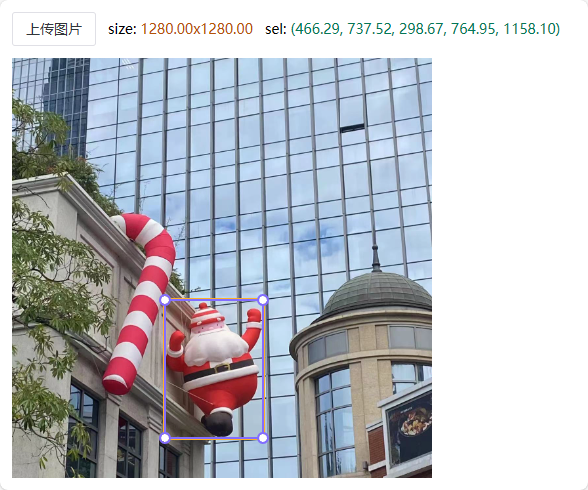

# Label Image

一个用于框选图片中内容位置的小工具。

[在线预览](https://ec50n9.github.io/label-img/)

功能很简单：

- 上传打开一张图片
- 点击选中橙黄色的选框
- 通过移动、放大缩小等操作来框选你**想要知道相对位置的元素**
- 往页面顶部瞟一眼，可以查看或复制位置和尺寸等数据。

其中数据是这个格式的：

```
size: 图片宽度 x 图片高度
sel: ( 选框左上角x坐标, 选框左上角y坐标, 选框宽度, 选框高度 )
```

当然你用 ps 或者其他修图工具也可以很轻易的获得这样的数据，并没有什么区别，只是我懒得打开 ps hhhh :D

## 预览



以上。
